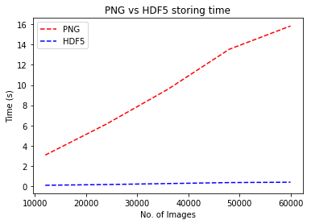
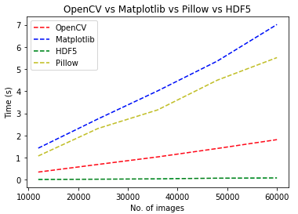

# Different ways of storing and reading large number of image files in Python

### Storing methods

1. PNG
2. HDF5

### Reading methods

1. OpenCV
2. Matplotlib
3. Pillow
4. HDF5

## Summary

### Storing methods comparison graph

### Reading methods comparison graph

